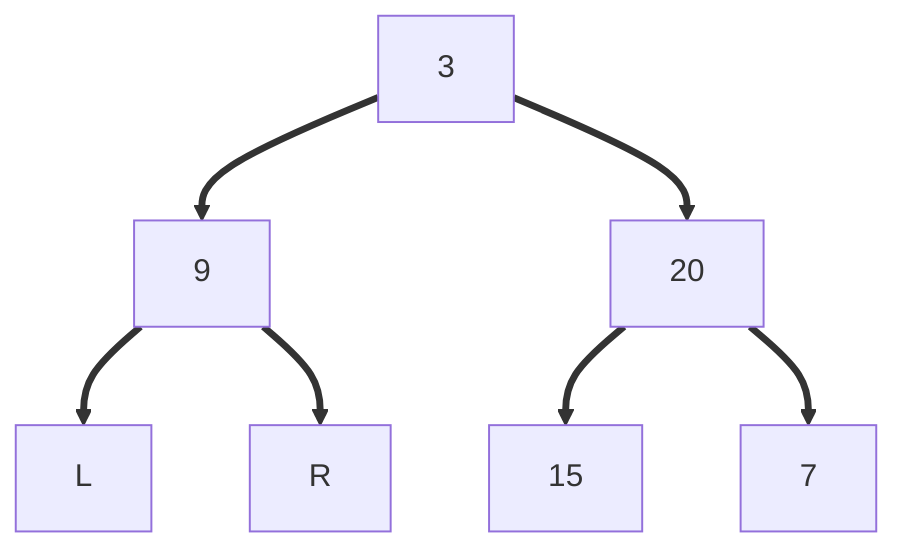

**Name**: 103 Binary Tree Zigzag Level Order Traversal
**Date:** 2024-03-19
**Type:** Binary Tree
**Difficulty:** Medium
**Link:** https://leetcode.com/problems/binary-tree-zigzag-level-order-traversal/description/


## submitted solution
```python
# Definition for a binary tree node.
# class TreeNode:
#     def __init__(self, val=0, left=None, right=None):
#         self.val = val
#         self.left = left
#         self.right = right
class Solution:
    def zigzagLevelOrder(self, root: Optional[TreeNode]) -> List[List[int]]:
        Node = namedtuple("Node", ["node", "level"])
        answer = []

        if root is not None:
            queue = deque([Node(node=root, level=0)])
        else:
            queue = deque()

        while len(queue) > 0:
            current = queue.pop()
            if len(answer) == current.level:
                answer.append([])
            
            answer[current.level].append(current.node.val)

            if current.node.left:
                queue.append(Node(node=current.node.left, level=current.level+1))
            if current.node.right:
                queue.append(Node(node=current.node.right, level=current.level+1))

        for x in range(0, len(answer), 2):
            answer[x].reverse()
        
        return answer
        
        
```

**Peeked at solution?:** No, but not most efficient

## submitted solution, explained
- you can't reverse the order without knowing all of the elements in a particular level
- just do bfs in left to right for all levels, then reverse the actual list for every other level

## optimal solution
- looks like the optimal solution does the same
- you can technically be more efficient by inserting into a particular level's list at the front or back of the list...? maybe...? I think low level doing that is expensive since it has to copy & push everything down if you insert at beginning for arrays, if linked list then cheap

## How do we actually traverse in zigzag order?
- two queues / stacks..?
- due to nature of the stack, you can have 1 level in a stack, and popping from top while adding the respective leaf nodes will result in zig zag
	- if you're going L->R, then you add nodes to the opposite stack R leaf then L leaf




```
stack1: 3 7 15 L R END
		X
stack2: 9 20 END
		X  X
```

#leetcode #algorithms 